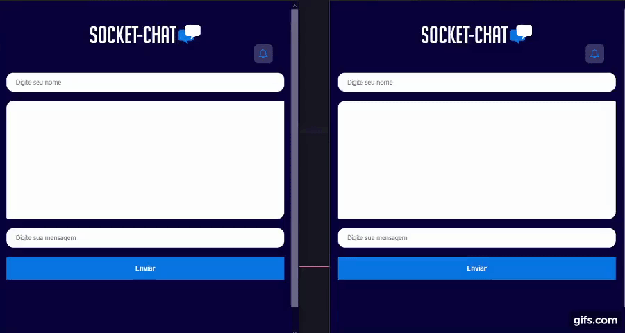

# Socket Chat
###### !!! I'M USING MY READMEs TO PRACTICE MY ENGLISH WRITE. PLEASE CORRECT ME IF I'M WRONG !!!

## 🏆 First time using socket
 Once time I needed to use socket and I didn't know how to use it, so I decided to study and now I can see how it's easy to do it work.



## 🎯 Goals
- ✉ `SEND MESSAGES`
- 📩 `RECIVE MESSAGES` 
- 🔔 `RECIVE NOTIFICATION`

## 🔌 Usage
```properties
-- npm install or yarn
-- node serve.js
```  
Open your browser on http://localhost:3000

### About
This small project helped me to learn about the socket. Thanks RocketSeat by the knowledge and idea.
<h4 align="center">
    🤘 Thanks for the attention! 🤘
</h4>
